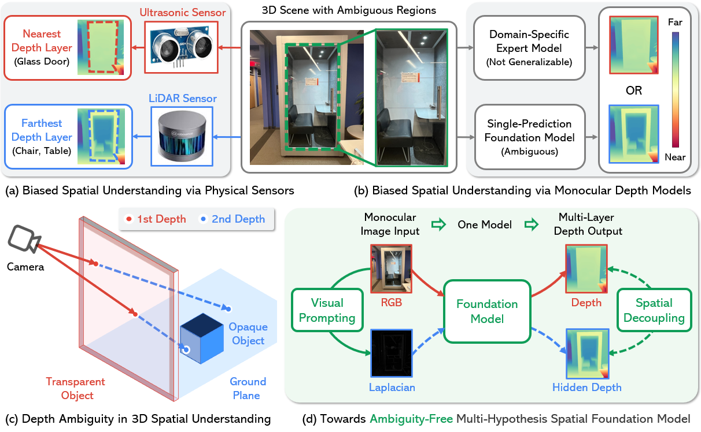

# Towards Ambiguity-Free Spatial Foundation Model

  

## Introduction

This repository provides resources for the paper "Ambiguity-Free Spatial Foundation Model: Rethinking and Decoupling Depth Ambiguity."

We address the fundamental challenge of depth ambiguity in spatial scene understanding, especially in transparent scenes.  Existing monocular depth models, with single-depth predictions, fail to capture multi-layer depth. We introduce **Multi-Hypothesis Spatial Foundation Models (MH-SFMs)** and propose:

1.  **MD-3k Benchmark:**  A new benchmark to evaluate multi-layer depth understanding and depth biases in ambiguous scenes.
2.  **Laplacian Visual Prompting (LVP):** A training-free technique to extract hidden depth from pre-trained models, enabling multi-hypothesis depth estimation without retraining.

Experiments demonstrate LVP's effectiveness for zero-shot multi-layer depth estimation and improved performance in downstream tasks.

  
   
  <em><b>Figure 1. Motivation.</b> 3D spatial understanding, powered by (a) sensors and (b) algorithms, has been confined to a biased single-layer representation of depth. (c) Existing methods collapse when faced with the true complexity of 3D, particularly in ambiguous scenes like those with transparency. (d) We propose Laplacian Visual Prompting (LVP) to transcend this limitation, granting Spatial Foundation Models the ability to derive multi-hypothesis depth, unlocking ambiguity-free spatial understanding.</em>

## Key Contributions

*   **MH-SFMs Paradigm:** Reformulation of depth estimation as multi-hypothesis inference to address spatial ambiguity.
*   **MD-3k Benchmark:** New dataset and metrics for evaluating multi-layer depth understanding and model biases.
*   **Depth Bias Analysis:**  Analysis of depth biases in existing models on MD-3k.
*   **Laplacian Visual Prompting (LVP):** Training-free method for multi-hypothesis depth estimation from pre-trained models.
*   **Extensive Validation:**  Demonstration of LVP's effectiveness and benefits for downstream applications.

## Getting Started (Code Release May 2025)

Code release planned for **May 2025**, including:

*   MD-3k dataset download instructions.
*   LVP implementation & evaluation scripts.
*   Example usage & experiment reproduction instructions.
